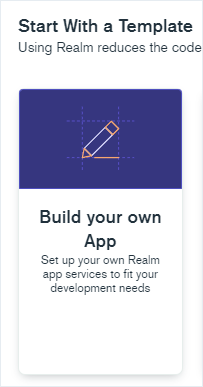

# 🔑 MongoDB

## Создание учётной записи в облачном сервисе MongoDB Realm 

Переходим по [ссылке](https://www.mongodb.com/realm/register):



Заполняем форму либо авторизуемся через **Google**:

 (1).png>)

После отправки формы (**Create account**) нас перенесут на страницу поздравления и попросят проверить почту на предмет письма для подтверждения регистрации.

В письме нажимаем кнопку **Verify Email**:

.png>)

Далее нажимаем кнопку **Continue**:

.png>)

Далее вас перенесут на экран создания приложения **MongoDB Realm**, выбирайте вариант **Build your own App**, затем нажимайте **Next**:

Заполняйте поля, как показано на картинке, затем нажимайте **Create Realm Application**:

 (1) (1).png>)

## Получение административных ключей MongoDB Realm

Находясь в личном кабинете MongoDB Realm, выберите пункт **Project Access** в меню **Access Manager**.

.png>)

Далее открываем вкладку **API Keys**, нажимаем кнопку **Create API Key**:

.png>)

Укажите параметры, как на картинке ниже:

.png>)

Далее нажимайте **Next**, вас перенесут на страницу с ключами 🔑, вводите их в параметры приложения PPP (публичный и приватный ключи MongoDB Realm).


Ключи будут недоступны для повторного копирования, когда вы закроете страницу.


На этом настройка завершена.
